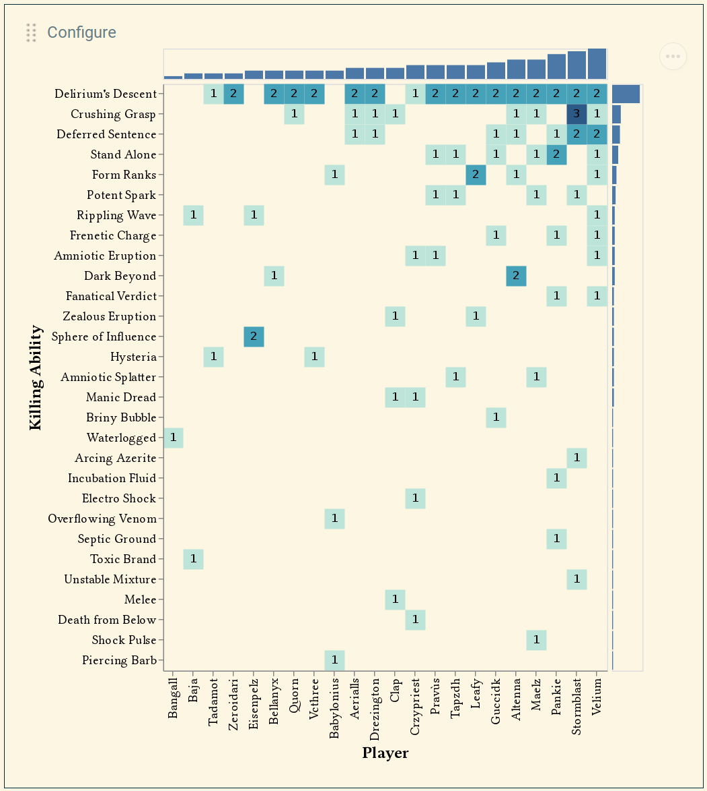

Client-side dashboard to visualize [WarcraftLogs](https://warcraftlogs.com)
query results.

Currently hosted on [Heroku](https://wcl-dashboard.herokuapp.com) with a lazy
dyno that only runs when requested. May need to refresh once or twice to have
it pop up.

# What does this look like?

This WA-like string:

```
N4Ig5grglgJiBcIDMAzAnAUzQVgAxIFoB2ARgEMMClsUUCS1c0CYMAOAFgwyQCZ8SAIxAAaEAGcADhgDGCUFLIyoAOzAJsYwUoDWYAE4B7CCriIAxChgoAbD1EhBx0+IQgUAGwjiAFg4BuMoYqMmQALggA2qAAtmT6Om7a+g4+GFBgPhHwSLhiGCGGMKrq8KAAHvLuUBgeZiBh8WAYYQByZDEYDmEAntJuKoYxqmQeDmTlUK7wKhAeHmLihvrZoCg1dW6N+s1tHV1ihpJuQSYRh/qsKYhk4jIFxWogAL7PYj1V67X1ZIJQHlBegA6FT7cZgAwYMDhLqIU4qc4NPqwkAARwgZARgPCUH8BxAEymCFm81ebwUkiUJQ0WmcMGm7i8vlSQRC4SioAKQUepQqnw29W2u3anW6yIGQxGYzEYUBHhRAAUPGQehgUotlqtqt8tk0WiL8UcTs5Ecsrm5bvdTNTXu9+Tqbn8AcDQaKZeLEINhqDpQ05SiANL/AFqAAEAEEnYCPhqVvbNo7/tGQWDDsc4SaHGa1W5WHcHjbbSBlarrtEQHEEm59LJEVyitSyiAgh5llUyBCa9Cwij4Yjev1EGapd1/W5zKHDChQwARDDhHyuRaheVVO5pUWIHujQReDCuN7FqEPYlzDxkkSxeKJLcYcp1wo8qo9+/tztQmHGs5iwcgYc+l5XgAXXJCtrySeIHAAd1gMI/ByPIQHrJ8m0qJsvgTBo9T2N0CXfbte0zd1f3RTFZUaWU8XGSZphJc87XQgULSjF1UyRX8vRHMRCVos9Yy1DCfhYnoU1wo0M2/C5zUQPMrSfMlnhAkCxHRNUPkYjwe2uEAAAodIHDAAF4AB0QBgDoOwwUzQ0xGBJzxBJg1DAA+UNcBs0wbOE0SMAAQhMkAAGVGghNVTIASknfRQ305EAtUcRGh0YNrNs0NBjCUNVFDfRMWaUMUCMGJQwMgKyEkSQPB6QQIFoVLPN+JNWM6ALWhaNJ9Cg0YdGssJDBKuLTJrGJDDxGq6pADy7Ma50RNdIzTLauC1S6jwesmgxjEkUNBB6UMlggfR7knFQSuw0MHnCyK0qFFogUMKCVDVHzQ0Ms6dju+apve3YgWKKRDHEQEoGCALCpqUwqtMhwnHEIH6l4Xg0DQBwZAgPraAQJAxGS0wqlx+oMDxBFALEVRWDQkhniAA
```

produces this visualization of deaths over an entire log:

<p align="center">

</p>

# How do I use this?

Data is collected for a [WCL query](https://www.warcraftlogs.com/help/pins),
then displayed according to
a [Vega-Lite](https://vega.github.io/vega-lite/examples/) (or [Vega](https://vega.github.io/vega/examples/), if you're crazy) spec.

# Limitations

- This is entirely client-side, with all the limitations that that entails.
- It is currently not possible to do state-based transforms like what are
  required for the [Arcing Current
  Tracker](https://colab.research.google.com/drive/1IjNkN-jsgkiI_qickQrrMTbjjG5Q0mnY).
  This is on my to-do list.
- You cannot combine results from multiple reports. Also on my to-do list.

# Contributing

I am not currently accepting contributions. Check again later.

If you want to run a local copy, you need to set the `API_KEY` environment
variable to your API key (or put it in a `.env` file as `API_KEY=whatever`).

# License

See [LICENSE](./LICENSE).
